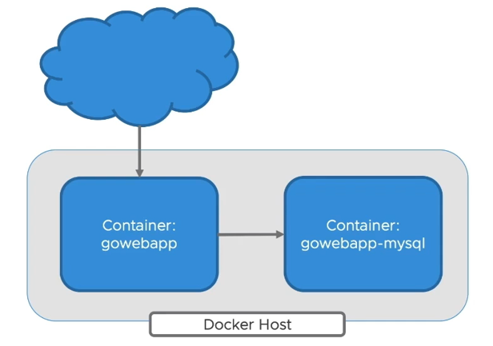

# 1: Containerize Applications

Estimated time: 30 minutes

## 1.1: Build Docker image for your _frontend_ application

### Step 1: Write Dockerfile for your frontend application

```sh
cd $K8S_LABS_HOME/gowebapp/gowebapp
```

Create a file named `Dockerfile` in this directory for the frontend Go application. Use any preferred text editor. The template below provides a starting point for defining the contents of this file.

***Note: Replace TODO comments with the appropriate commands***

```dockerfile
#TODO --- Define this image to inherit from the "ubuntu" base image and version "jammy"
#https://hub.docker.com/_/ubuntu
#https://docs.docker.com/engine/reference/builder/#from

EXPOSE 8080
USER 1000

#TODO --- Copy source code in the ./code directory into /opt/gowebapp
#https://docs.docker.com/engine/reference/builder/#copy

#TODO --- Copy the application config in the ./config directory into 
#/opt/gowebapp/config

WORKDIR /opt/gowebapp/

#TODO --- Define an entrypoint for this image which executes the gowebapp 
#application (/opt/gowebapp/gowebapp) when the container starts
#https://docs.docker.com/engine/reference/builder/#entrypoint
```

### Step 2: Build `gowebapp` Docker image locally

```sh
cd $K8S_LABS_HOME/gowebapp/gowebapp
```

Build the `gowebapp` image locally. Make sure to include &ldquo;.&rdquo; at the end. Make sure the build runs to completion without errors. You should get a success message.

```sh
docker build -t gowebapp:v1 .
```

## 1.2: Build Docker image for your _backend_ application

### Step 1: Write Dockerfile for your backend application

```sh
cd $K8S_LABS_HOME/gowebapp/gowebapp-mysql
```

Create a file named `Dockerfile` in this directory for the backend MySQL database application. Use any preferred text editor. The template below provides a starting point for defining the contents of this file.

***Note: Replace TODO comments with the appropriate commands***

```dockerfile
#TODO --- Define this image to inherit from the "mysql" version 8.0 base image
#https://hub.docker.com/_/mysql/
#https://docs.docker.com/engine/reference/builder/#from

USER 1000

#TODO --- Investigate the "Initializing a Fresh Instance" instructions for the mysql 
#parent image, and copy the local gowebapp.sql file to the proper container directory 
#to be automatically executed when the container starts up 
#https://hub.docker.com/_/mysql/
#https://docs.docker.com/engine/reference/builder/#copy
```

### Step 2: Build `gowebapp-mysql` Docker image locally

```sh
cd $K8S_LABS_HOME/gowebapp/gowebapp-mysql
```

Build the `gowebapp-mysql` image locally. Make sure to include &ldquo;.&rdquo; at the end. Make sure the build runs to completion without errors. You should get a success message.

```sh
docker build -t gowebapp-mysql:v1 .
```

## 1.3: Run and test Docker images locally

Before deploying to Kubernetes, let&rsquo;s run and test the Docker images locally, to ensure that the frontend and backend containers run and integrate properly.

### Step 1: Create Docker user-defined network

To facilitate cross-container communication, let&rsquo;s first define a user-defined network in which to run the frontend and backend containers:

```sh
docker network create gowebapp
```

### Step 2: Launch frontend and backend containers

Next, let&rsquo;s launch a frontend and backend container using the Docker CLI.

First, we launch the database container, as it will take a bit longer to startup, and the frontend container depends on it. Notice how we are injecting the database password into the MySQL configuration as an environment variable:

On \*nix,

```sh
docker run --net gowebapp \
    --name gowebapp-mysql \
    --hostname gowebapp-mysql \
    -e MYSQL_ROOT_PASSWORD=mypassword \
    -d \
    gowebapp-mysql:v1
```

On Windows,

```sh
docker run --net gowebapp ^
    --name gowebapp-mysql ^
    --hostname gowebapp-mysql ^
    -e MYSQL_ROOT_PASSWORD=mypassword ^
    -d ^
    gowebapp-mysql:v1
```

⚠ ***Warning: Wait at least 20 seconds after starting the backend before attempting to start the frontend. Right now, the frontend will crash if the backend is not ready.***

Now launch a frontend container, mapping the container port `8080` - where the web application is exposed - to port `9000` on the host machine:

On \*nix,

```sh
docker run --net gowebapp \
    --name gowebapp \
    --hostname gowebapp \
    -p 9000:8080 \
    -d \
    gowebapp:v1
```

On Windows,

```sh
docker run --net gowebapp ^
    --name gowebapp ^
    --hostname gowebapp ^
    -p 9000:8080 ^
    -d ^
    gowebapp:v1
```

### Step 3: Test the application locally

Now that we&rsquo;ve launched the application containers, let&rsquo;s try to test the web application locally.



You should be able to access the application by opening [http://localhost:9000](http://localhost:9000) in a browser.

Create an account and login. Write something on your Notepad and save it. This will verify that the application is working and properly integrates with the backend database container.

### Step 4: Inspect the MySQL database

Let&rsquo;s connect to the backend MySQL database container and run some queries to ensure that application persistence is working properly:

```sh
docker exec -it gowebapp-mysql mysql -u root -pmypassword gowebapp
```

Once connected, run some simple SQL commands to inspect the database tables and persistence:

```sql
#Simple SQL to navigate
SHOW DATABASES;
USE gowebapp;
SHOW TABLES;
SELECT * FROM <table_name>;
exit;
```

_Write down the tables used in the gowebapp. You may be asked during the lab exercise debrief._

<textarea rows="3" style="width: 100%; max-width: 60em" placeholder="Temporarily paste your answers here." spellcheck="false"></textarea>

### Step 5: Cleanup application containers

When we&rsquo;re finished testing, we can terminate and remove the currently running frontend and backend containers from our local machine:

```sh
docker rm -f gowebapp gowebapp-mysql
```

## 1.4: Push images to a registry

☝ _Skip these steps when using Docker Desktop&rsquo;s Kubernetes. Proceed to section 1.5._

Why? 🤔

_When using Docker Desktop's built-in Kubernetes, developers benefit from a fast &ldquo;inner-loop&rdquo; where they can &ldquo;docker build&rdquo; an image and then immediately test it from Kubernetes without having to push and then re-pull, all thanks to Docker&rsquo;s shared image store and [cri-dockerd](https://github.com/Mirantis/cri-dockerd) (formerly dockershim for Kubernetes before 1.24)._

_If you need a target Kubernetes cluster to pull the updated image, you'll need to push the image to the registry. Here&rsquo;s how._

### Step 1: Tag images to target registry

We are finished testing our images. We now need to push our images to an image registry so our Kubernetes cluster can access them. First, we need to tag our Docker images to use the registry in your lab environment:

```sh
docker tag gowebapp:v1 $REGISTRY_HOST/gowebapp:v1
```

```sh
docker tag gowebapp-mysql:v1 $REGISTRY_HOST/gowebapp-mysql:v1
```

Replace `$REGISTRY_HOST` with actual registry host (e.g. registry.example.com/group/project/my-image:v1).

### Step 2: Publish images to the registry

```
docker push $REGISTRY_HOST/gowebapp:v1
docker push $REGISTRY_HOST/gowebapp-mysql:v1
```

Note that the registry may need some form of authentication (e.g. `docker login`).


## 1.5: Conclusion

Congratulations! By containerizing your application components, you have taken the first important step toward deploying your application to Kubernetes.
