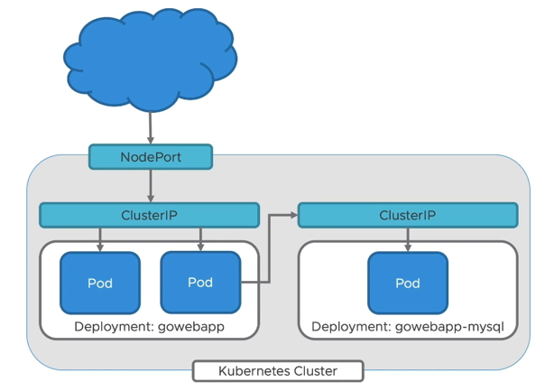

# 2: Deploy Applications Using Kubernetes

Estimated time: 30 minutes



## 2.1: Getting Started with `kubectl`

### Step 1: Introduction to `kubectl`

By executing `kubectl` you will get a list of options available. `kubectl` allows you to interact with the Kubernetes API server.

```sh
kubectl
```

### Step 2: Use `kubectl` to understand an object

Use explain to get documentation of various resources. For instance, pods, nodes, services, etc.

```sh
kubectl explain pods
```

### Step 3: Get more information on an object

Get a list of available resource types:

```sh
kubectl api-resources
```

## 2.2: Create Service Object for MySQL

### Step 1: Define a Kubernetes Service object for the backend MySQL database

```sh
cd $K8S_LABS_HOME/gowebapp
```

Use your preferred text editor to create a file called `gowebapp-mysql-service.yaml`. Follow instructions below to populate `gowebapp-mysql-service.yaml`.

If you need help, please see reference: https://kubernetes.io/docs/concepts/services-networking/service/#defining-a-service

***Note: Replace TODO comments with the appropriate commands***

```yaml
apiVersion: v1
kind: Service
metadata: 
  #TODO: give the Service a name: gowebapp-mysql
  labels:
    #TODO: give the Service a label: app: gowebapp-mysql
    #TODO: give the Service a label: tier: backend
spec:
  type: ClusterIP
  ports:
  - #TODO: expose port 3306
    targetPort: 3306
  selector:
    #TODO: define a selector: app: gowebapp-mysql
    #TODO: define a selector: tier: backend
```

### Step 2: Create a Service defined above

Use `kubectl` to create the Service defined above

```sh
kubectl apply -f gowebapp-mysql-service.yaml
```

### Step 3: Test to make sure the Service was created

```sh
kubectl get service -l "app=gowebapp-mysql"
```

## 2.3: Create Deployment Object for MySQL

### Step 1: Define a Kubernetes Deployment object for the backend MySQL database

```sh
cd $K8S_LABS_HOME/gowebapp
```

Use your preferred text editor to create a file called `gowebapp-mysql-deployment.yaml`. Follow instructions below to populate `gowebapp-mysql-deployment.yaml`.

If you need help, please see reference: https://kubernetes.io/docs/concepts/workloads/controllers/deployment

***Note: Replace TODO comments with the appropriate commands***

```yaml
apiVersion: apps/v1
#TODO: define the kind of object as Deployment
metadata: 
  #TODO: give the deployment a name name: gowebapp-mysql
  labels:
    #TODO: give the Deployment a label: app: gowebapp-mysql
    #TODO: give the Deployment a label: tier: backend
spec:
  #TODO: set replicas to 1
  strategy: 
    #TODO: define the type of strategy as Recreate
  selector:
    matchLabels:
      app: gowebapp-mysql
      tier: backend
  template:
    metadata:
      labels:
        app: gowebapp-mysql
        tier: backend
    spec:
      containers:
      - name: gowebapp-mysql
        image: gowebapp-mysql:v1 
        env:
        - name: MYSQL_ROOT_PASSWORD
          value: mypassword
        ports:
        - #TODO: define the container port as 3306
```

☝ _Skip the changes below when using Docker Desktop&rsquo;s Kubernetes. Proceed to step 2._

We are using a custom image that we created in a previous lab. Therefore we need to add the registry server to the `image:` line in the YAML so that Kubernetes knows which registry to pull the image from. Otherwise it will try to find the image on the public/default configured registry server (e.g. Docker Hub).

```yaml
apiVersion: apps/v1
kind: Deployment
# ...
spec:
  # ...
  template:
    # ...
    spec:
      containers:
      - name: gowebapp-mysql
        image: registry.example.com/group/project/gowebapp-mysql:v1 # 👈
  #            👆
  # ...
```

### Step 2: Create the Deployment defined above

Use `kubectl` to create the Deployment defined above

```sh
kubectl apply -f gowebapp-mysql-deployment.yaml
```

### Step 3: Test to make sure the Deployment was created

```sh
kubectl get deployment -l "app=gowebapp-mysql"
```

## 2.4: Create Service object for frontend application: gowebapp

### Step 1: define a Kubernetes Service object for the frontend gowebapp

```sh
cd $K8S_LABS_HOME/gowebapp
```

Use your preferred text editor to create a file called `gowebapp-service.yaml`. Follow instructions below to populate `gowebapp-service.yaml`.

If you need help, please see reference: https://kubernetes.io/docs/concepts/services-networking/service/#defining-a-service

***Note: Replace TODO comments with the appropriate commands***

```yaml
apiVersion: v1
#TODO: define the kind of object as Service
metadata: 
  #TODO: give the Service a name: gowebapp
  labels:
    #TODO: give the Service a label: app: gowebapp
    #TODO: give the Service a label: tier: frontend
spec:
  #TODO: Set service type to NodePort
  ports:
  - #TODO: expose port 8080
    # By default and for convenience, the `targetPort`
    # is set to the same value as the `port` field.
    #targetPort: 8080
    # `nodePort` is an optional field
    # By default and for convenience, the Kubernetes
    # control plane will allocate a port from a range (default: 30000-32767)
  selector:
    #TODO: define a selector: app: gowebapp
    #TODO: define a selector: tier: frontend
```

### Step 2: create a Service defined above

Use `kubectl` to create the service defined above

```sh
kubectl apply -f gowebapp-service.yaml
```

### Step 3: test to make sure the Service was created

```sh
kubectl get service -l "app=gowebapp"
```

## 2.5: Create Deployment object for gowebapp

### Step 1: define a Kubernetes Deployment object for the frontend gowebapp

```sh
cd $K8S_LABS_HOME/gowebapp
```

Use your preferred text editor to create a file called `gowebapp-deployment.yaml`. Follow instructions below to populate `gowebapp-deployment.yaml`.

If you need help, please see reference: https://kubernetes.io/docs/concepts/workloads/controllers/deployment

***Note: Replace TODO comments with the appropriate commands***

```yaml
apiVersion: apps/v1
#TODO: define the kind of object as Deployment
metadata: 
  #TODO: give the deployment a name name: gowebapp
  labels:
    #TODO: give the Deployment a label: app: gowebapp
    #TODO: give the Deployment a label: tier: frontend
spec:
  #TODO: set replicas to 2
  selector:
    matchLabels:
      app: gowebapp
      tier: frontend
  template:
    metadata:
      labels:
        app: gowebapp
        tier: frontend
    spec:
      containers:
      - name: gowebapp
        image: gowebapp:v1
        env:
        - #TODO: define name as DB_PASSWORD
          #TODO: define value as mypassword
        ports:
        - #TODO: define the container port as 8080
```

☝ _Skip the changes below when using Docker Desktop&rsquo;s Kubernetes. Proceed to step 2._

We are using a custom image that we created in a previous lab. Therefore we need to add the registry server to the `image:` line in the YAML so that Kubernetes knows which registry to pull the image from. Otherwise it will try to find the image on the public/default configured registry server (e.g. Docker Hub).

```yaml
apiVersion: apps/v1
kind: Deployment
# ...
spec:
  # ...
  template:
    # ...
    spec:
      containers:
      - name: gowebapp
        image: registry.example.com/group/project/gowebapp:v1 # 👈
  #            👆
  # ...
```


### Step 2: create the Deployment defined above

Use `kubectl` to create the Deployment defined above

```sh
kubectl apply -f gowebapp-deployment.yaml
```

### Step 3: test to make sure the Deployment was created

```sh
kubectl get deployment -l "app=gowebapp"
```

## 2.6: Test Your Application

### Step 1: Access gowebapp through the Service

Since a `NodePort` type of Service (see https://kubernetes.io/docs/concepts/services-networking/service/#nodeport) is created (see `gowebapp-service.yaml`), and the `nodePort` is not specified, the Kubernetes control plane will allocate a port from a range (default:&nbsp;30000-32767). To know which port was allocated, run the following command.

```sh
kubectl get svc
```

Note: In the above command, we used the abbreviation `svc` instead of `services`. Many resource types have abbreviated forms. For a complete list, you can run `kubectl api-resources`.

Look under the `PORT(S)` column in the output.

```
                                                                    👇
NAME                     TYPE        CLUSTER-IP       EXTERNAL-IP   PORT(S)          AGE
service/gowebapp         NodePort    10.109.127.117   <none>        8080:32139/TCP   12m
                                                                          👆
service/gowebapp-mysql   ClusterIP   10.107.230.91    <none>        3306/TCP         12m
service/kubernetes       ClusterIP   10.96.0.1        <none>        443/TCP          20m
```

From the output above, port `32139` was allocated (which should be accessible from `localhost` for docker-desktop &mdash; single-node cluster).

After running `kubectl get svc`, and noting the port, you should be able to access `gowebapp` through the Service by opening `http://localhost` in a browser _with the port_ that Kubernetes has allocated.

***Warning: Your browser may cache an old instance of the gowebapp application from previous labs. When the webpage loads, look at the top right. If you see &lsquo;Logout&rsquo;, click it. You can then proceed with creating a new test account.***

## 2.7: Conclusion

Congratulations! You have successfully deployed your applications using Kubernetes!
