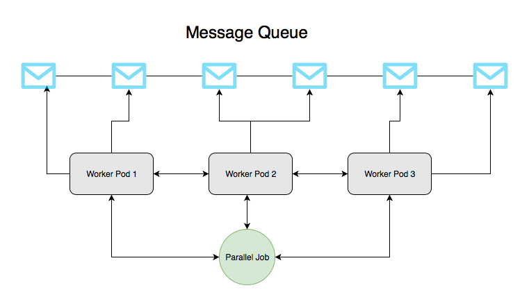

# 10: Additional Workloads

Estimated time: 20 minutes

## 10.1: Manual Run Jobs

Jobs are a handy way to execute &ldquo;run to completion&rdquo; style workloads, unlike Deployments which are meant to run forever until they are terminated by an error or by a user. Let&rsquo;s explore running the job below which calculates the value of pi.

```sh
cd $K8S_LABS_HOME/gowebapp
```

Use your preferred text editor to create a file called `pi-job.yaml` and populate it with the lines below.

***Note: Replace TODO comments with the appropriate commands***

`pi-job.yaml`

```yaml
apiVersion: batch/v1
kind: # TODO: Set kind to Job
metadata:
  name: pi
spec:
  template:
    metadata:
      name: pi
    spec:
      securityContext:
        runAsUser: 1000
      containers:
      - name: pi
        image: perl
        command: ["perl", "-Mbignum=bpi", "-wle", "print bpi(2000)"] 
      restartPolicy: Never
```

```
kubectl apply -f pi-job.yaml
```

Notice the following observations:

- After the container exits successfully Kubernetes does not try to start another container like it does with Deployments
- The Pod and Job stick around after completion so that you can view the output

Find the output calculated by the pi job using `kubectl` commands (get, describe, logs).

Try applying the YAML again with `kubectl`, does the job run a second time? What would you need to do if you wanted to rerun the job?

## 10.2: Parallel Jobs with a Work Queue

Parallel jobs with a work queue can create several pods which coordinate with themselves or with some external service which part of the job to work on.

If your application has a work queue implementation for some remote data storage, for example, this type of Job can create several parallel worker pods that will independently access the work queue and process it.

Parallel jobs with a work queue come with the following features and requirements:

- for this type of Job, you should leave `.spec.completions` unset.
- each worker pod created by the Job is capable of assessing whether or not all its peers are done and, thus, the entire Job is done (e.g. each pod can check if the work queue is empty and exit if so).
- when any pod terminates with success, no new pods are created.
- once at least one pod has exited with success and all pods are terminated, then the job completes with success as well.
- once any pod has exited with success, other pods should not be doing any work and should also start exiting.

Let&rsquo;s add parallelism to see how these types of Jobs work, notice the `.spec.parallelism` field was added and set to `3`.

```sh
cd $K8S_LABS_HOME/gowebapp
```

Use your preferred text editor to create a file called `para-job.yaml` and populate it with the lines below.

***Note: Replace TODO comments with the appropriate commands***

`para-job.yaml`

```yaml
apiVersion: batch/v1
kind: Job
metadata:
  name: primes-parallel-wq
  labels:
    app: primes
spec:
  parallelism: # TODO: Set parallelism to 3
  template:
    metadata:
      name: primes
      labels:
        app: primes
    spec:
      securityContext:
        runAsUser: 1000
      containers:
      - name: primes
        image: debian:stable-slim
        command: ["bash"]
        args: ["-c",  "current=0; max=110; echo 1; echo 2; for((i=3;i<=max;)); do for((j=i-1;j>=2;)); do if [  `expr $i % $j` -ne 0 ] ; then current=1; else current=0; break; fi; j=`expr $j - 1`; done; if [ $current -eq 1 ] ; then echo $i; fi; i=`expr $i + 1`; done"]
      restartPolicy: Never
```

Now, let&rsquo;s open two terminal windows. In the ☝ _first_ terminal, watch the pods:

```sh
kubectl get pods -l app=primes -w
```

Apply `para-job.yaml` using a ✌ _second_ terminal.

```sh
kubectl apply -f para-job.yaml
```

Next, let&rsquo;s see what&rsquo;s happening in the _first_ terminal window:

```console
$ kubectl get pods -l app=primes -w

NAME                    READY     STATUS              RESTARTS   AGE
primes-parallel-b2whq   0/1       Pending             0          0s
primes-parallel-b2whq   0/1       Pending             0          0s
primes-parallel-vhvqm   0/1       Pending             0          0s
primes-parallel-cdfdx   0/1       Pending             0          0s
primes-parallel-vhvqm   0/1       Pending             0          0s
primes-parallel-cdfdx   0/1       Pending             0          0s
primes-parallel-b2whq   0/1       ContainerCreating   0          0s
primes-parallel-vhvqm   0/1       ContainerCreating   0          0s
primes-parallel-cdfdx   0/1       ContainerCreating   0          0s
primes-parallel-b2whq   1/1       Running             0          4s
primes-parallel-cdfdx   1/1       Running             0          7s
primes-parallel-vhvqm   1/1       Running             0          10s
primes-parallel-b2whq   0/1       Completed           0          17s
primes-parallel-cdfdx   0/1       Completed           0          21s
primes-parallel-vhvqm   0/1       Completed           0          23s
```

As you see, the `kubectl` created three pods simultaneously. Each pod was calculating the prime numbers in parallel and once each of them completed the task, the Job was successfully completed as well.

In a real-world scenario, we could imagine a Redis list with some work items (e.g messages, emails) in it and three parallel worker pods created by the Job (see the Image below). Each pod could have a script to requests a new message from the list, process it, and check if there are more work items left.

If no more work items exist in the list, the pod accessing it would exit with success telling the controller that the work was successfully done. This notification would cause other pods to exit as well and the entire job to complete. Given this functionality, parallel jobs with a work queue are extremely powerful in processing large volumes of data with multiple workers doing their tasks in parallel.



Example: https://kubernetes.io/docs/tasks/job/fine-parallel-processing-work-queue/

## 10.3: Scheduled Jobs

In the above scenario we ran a job manually and once. Sometimes you want to run a job at a regular scheduled interval or once at a particular time. CronJobs in Kubernetes provide this functionality.

```sh
cd $K8S_LABS_HOME/gowebapp
```

Use your preferred text editor to create a file called `cronjob.yaml` and populate it with the lines below.

***Note: Replace TODO comments with the appropriate commands***

`cronjob.yaml`

```yaml
apiVersion: batch/v1
kind: # TODO: Set kind to CronJob
metadata:
  name: hello
spec:
  schedule: "* * * * *"
  jobTemplate:
    spec:
      template:
        spec:
          securityContext:
            runAsUser: 1000
          containers:
          - name: hello
            image: busybox
            args:
            - /bin/sh
            - -c
            - date; echo Hello from the Kubernetes cluster
          restartPolicy: OnFailure
```

```sh
kubectl apply -f cronjob.yaml
```

This will schedule the job to run _every minute_. We watch this in action by both view the job or watching the job:

```sh
kubectl get cronjob hello
```
```
NAME      SCHEDULE      SUSPEND   ACTIVE    LAST SCHEDULE   AGE
hello     * * * * *   False     0         <none>          9s
```

```sh
kubectl get jobs --watch
```
```
NAME               DESIRED   SUCCESSFUL   AGE
hello-1543405740   1         1            23s
```

## 10.4: Conclusion

You should now be familiar with running Jobs and CronJobs in Kubernetes essentially allowing it to be a distributed batch processing system.
